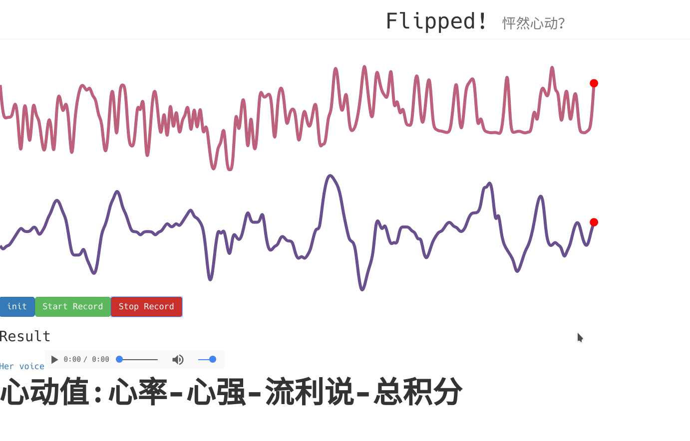

# Flipped

A backend program for [Hack.init](http://hackinit.org/) project.

<p align="center">
  <a href="https://grox-ni.github.io/" target="_blank">
    
    <br>
    Live Demo
  </a>
</p>

## Prerequisite
- Golang
- Govendor
- Makefile
- Mysql

## Quick start
- config
```
cp config.example.json config.json
change config in config.json
```
- pull pkgs
```
govender sync
```
- build
```
make dev-build
```
- run 
```
make dev-run
```

## Frontend
Thanks to @Grox-Ni, he writes the frontend project:[Flipped](https://github.com/Grox-Ni/Flipped)
